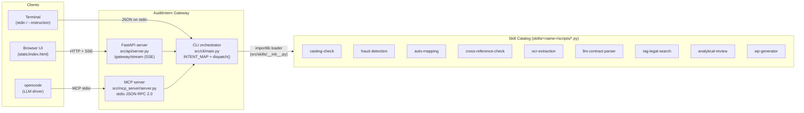
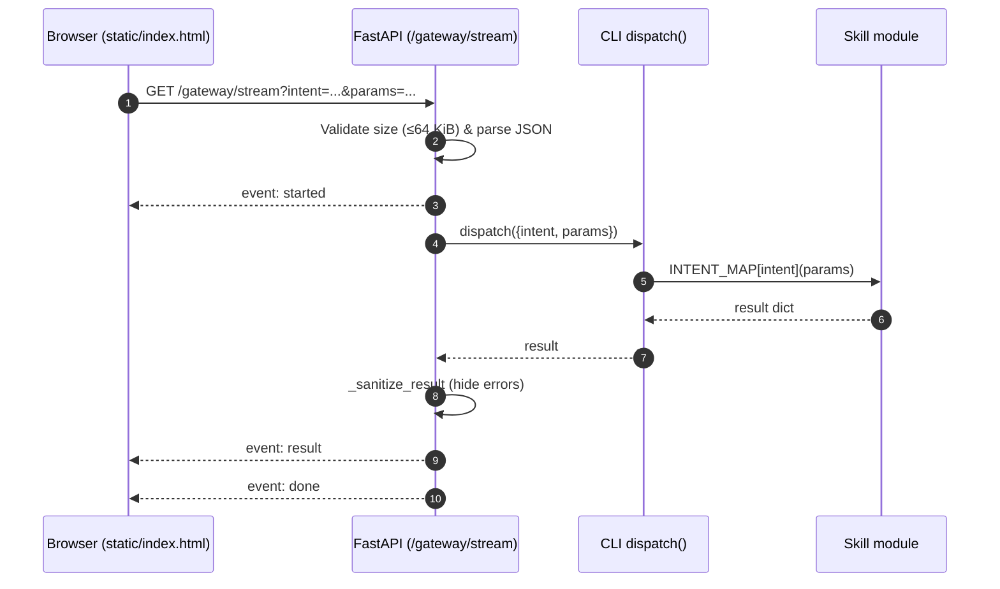
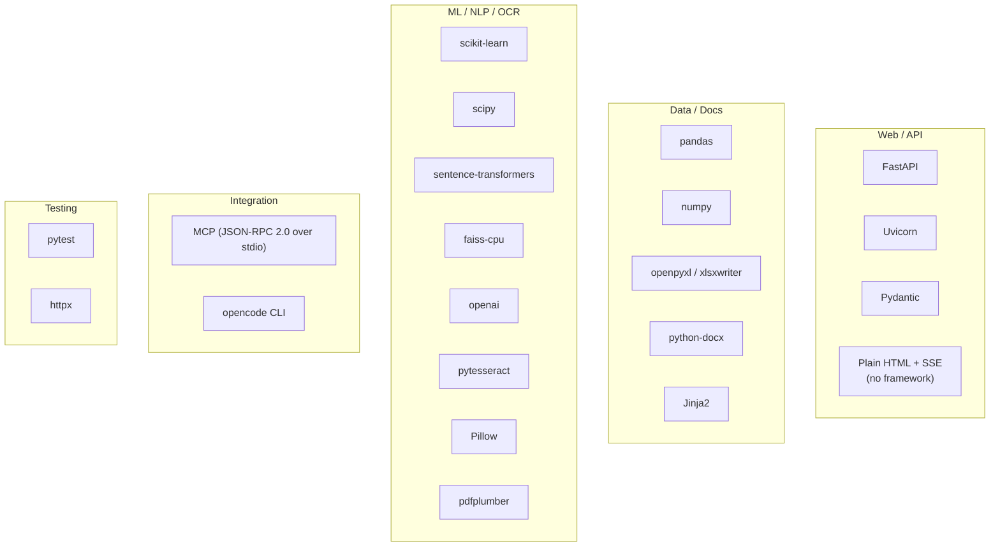
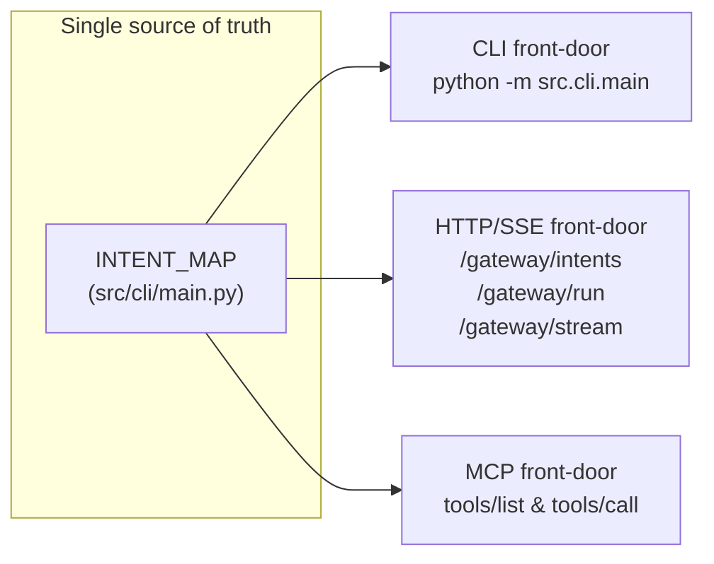

# AuditIntern

AI-assisted audit system with LLM, OCR, and rule-based engines.

## Architecture at a Glance

AuditIntern is a **thin Gateway** over a shared catalog of audit skills. The same
`INTENT_MAP` in `src/cli/main.py` is re-used by every front-door (CLI, HTTP/SSE
Gateway, MCP server), so the three entry paths stay in lock-step.



### Request flow — browser → Gateway → skill (SSE)



## Features

| Skill | Intent (`INTENT_MAP`) | What it does |
|---|---|---|
| 🧮 Casting Check | `run_casting_check` | Validate row/column totals in financial spreadsheets |
| 🕵️ Fraud Detection | `run_fraud_scan` | Benford's Law + rule-based journal entry analysis |
| 🔗 Auto Mapping | `run_auto_mapping` | NLP-based mapping of client accounts to standard COA |
| 🧾 Cross Reference Check | `run_cross_reference` | Validate consistency across multiple financial documents |
| 👁️ OCR Extraction | `run_ocr` | Extract text from images and PDFs |
| 📄 LLM Contract Parser | `run_contract_parse` | Extract structured fields from contracts using GPT |
| ⚖️ RAG Legal Search | `run_rag_search` | TF-IDF retrieval over legal knowledge bases |
| 📊 Analytical Review | `run_analytical_review` | Period-over-period variance analysis |
| 📝 Work Paper Generator | `run_wp_generate` | Fill Excel/Word templates with audit data |

## Tech Stack



## Tutorial — 从零开始下载、安装、配置与启动

这一章面向**完全没接触过本项目**的用户，一步步带你把 AuditIntern 跑起来。
只需跟着执行，全程大约 5–10 分钟。

### 0. 前置要求

| 依赖 | 最低版本 | 说明 |
|---|---|---|
| Python | 3.10+ | 见 `pyproject.toml` 的 `requires-python` |
| pip | 最新 | 随 Python 自带 |
| git | 任意 | 用于 clone 仓库 |
| Tesseract OCR | 可选 | 需要 `ocr-extraction` 技能时安装（`apt install tesseract-ocr` 或 macOS `brew install tesseract`） |
| opencode CLI | 可选 | 仅当你想让 LLM 通过 MCP 调用技能时需要（见第 5 步） |

> Windows 用户推荐使用 WSL2 或 Git Bash 来运行下文的 shell 命令。

### 1. 下载源码

```bash
git clone https://github.com/xhyccc/AuditIntern.git
cd AuditIntern
```

### 2. 创建并激活虚拟环境（强烈推荐）

```bash
python -m venv .venv

# Linux / macOS
source .venv/bin/activate

# Windows (PowerShell)
# .venv\Scripts\Activate.ps1
```

### 3. 安装 Python 依赖

```bash
pip install --upgrade pip
pip install -r requirements.txt
```

### 4. 配置（环境变量）

所有配置都通过环境变量提供，按需设置：

```bash
# 调用 LLM 相关技能（llm-contract-parser 等）时需要
export OPENAI_API_KEY="sk-..."

# 可选：如果你使用 Azure / 自托管网关，覆盖 base URL
# export OPENAI_BASE_URL="https://your-endpoint/v1"
```

如果只想试试 `casting-check` / `fraud-detection` / `analytical-review` 这类
不调用外部 LLM 的技能，可以**跳过这一步**。

### 5. （可选）安装 opencode CLI

只有当你打算让 LLM 通过 MCP 自动编排技能时才需要：

```bash
# 最新版
bash scripts/install-opencode.sh

# 或锁定版本
OPENCODE_VERSION=0.3.0 bash scripts/install-opencode.sh
```

脚本会把二进制安装到 `~/.opencode/bin`，已安装则自动跳过。

### 6. 冒烟测试：跑一次测试套件

确认安装成功最快的办法是跑 pytest：

```bash
pytest tests/ -v
```

全部通过说明依赖和代码都装好了。

### 7. 启动三个入口之一

本项目是"同一份技能目录 + 三个前门"，按你的用法选一个启动即可。

**7a. CLI（命令行，最轻量）**

```bash
echo '{"intent": "run_casting_check", "params": {"file_path": "data.csv", "output_path": "result.json"}}' \
  | python -m src.cli.main
```

**7b. Gateway（FastAPI + SSE + 浏览器 UI，最推荐新手）**

```bash
uvicorn src.api.server:app --reload
```

启动后：

- 交互式 API 文档：<http://localhost:8000/docs>
- 内置前端 UI：<http://localhost:8000/ui/>
  （选择 intent，编辑 `params` JSON，实时看到 `started` / `result` / `done` 事件）

**7c. MCP Server（给 opencode 等 LLM 驱动用）**

```bash
python -m src.mcp_server.server
```

然后在 `opencode` 配置里把这条命令注册为一个 MCP server，LLM 就能直接调用
`INTENT_MAP` 里的所有技能。

### 8. 下一步

- 完整技能输入/输出参数参见 [SKILLS.md](SKILLS.md)
- 新增技能只需 3 步，见文末 "How the three front-doors stay in sync"
- 遇到问题先跑 `pytest tests/ -v` 排查依赖/环境

---

## Quick Start

```bash
pip install -r requirements.txt
```

### CLI Usage

```bash
# From stdin
echo '{"intent": "run_casting_check", "params": {"file_path": "data.csv", "output_path": "result.json"}}' \
  | python -m src.cli.main

# From instruction file
python -m src.cli.main --instruction instruction.json
```

### API Server

```bash
uvicorn src.api.server:app --reload
```

API docs at http://localhost:8000/docs

### Gateway UI (plain HTML + SSE)

Once the API server is running, open <http://localhost:8000/ui/> for the
built-in Gateway frontend: pick an intent, edit the `params` JSON, and watch
`started` / `result` / `done` events stream in via SSE. The same intents are
also served to the `opencode` LLM driver through the MCP server below, so the
full data path is:

```
opencode → MCP (src/mcp_server) → src/skills/*
browser  → Gateway SSE (/gateway/stream) → src/skills/*
```

### MCP Server (for opencode)

Expose every skill as an MCP tool over stdio:

```bash
python -m src.mcp_server.server
```

Point your `opencode` config at that command to let the LLM call skills
directly. Tool names match `INTENT_MAP` in `src/cli/main.py`; each tool takes
a single `params` object forwarded verbatim to the skill.

## Testing

```bash
pytest tests/ -v
```

## Installing the opencode Binary

The Gateway orchestrator uses the [opencode](https://opencode.ai) CLI as the
LLM "brain" that calls our skills through an MCP server. To install it in CI
or any runtime environment, run:

```bash
# latest
bash scripts/install-opencode.sh

# pin a specific version
OPENCODE_VERSION=0.3.0 bash scripts/install-opencode.sh
```

The script is idempotent (skips the download if `opencode` is already on
`PATH`), installs to `~/.opencode/bin` by default, and — when running under
GitHub Actions — appends that directory to `$GITHUB_PATH` so later steps can
invoke `opencode` directly. The provided `.github/workflows/ci.yml` caches
`~/.opencode` across runs.

## Skills Reference

See [SKILLS.md](SKILLS.md) for full documentation of all available skills.

## Project Structure

```
AuditIntern/
├── src/
│   ├── cli/          # CLI orchestrator — defines INTENT_MAP + dispatch()
│   ├── skills/       # Dynamic loader (importlib) — re-exports skills/*/scripts
│   ├── mcp_server/   # MCP server exposing skills to opencode over stdio
│   ├── api/          # FastAPI backend + Gateway SSE endpoint (/gateway/stream)
│   └── utils/        # Project / session management
├── skills/           # Skill catalog (Anthropic-style: SKILL.md + scripts/ + assets/)
│   ├── casting-check/
│   ├── fraud-detection/
│   ├── auto-mapping/
│   ├── cross-reference-check/
│   ├── ocr-extraction/
│   ├── llm-contract-parser/
│   ├── rag-legal-search/
│   ├── analytical-review/
│   └── wp-generator/
├── static/           # Gateway frontend (plain HTML + SSE, served at /ui)
├── scripts/          # install-opencode.sh and friends
├── tests/            # Pytest test suite
├── requirements.txt
├── pyproject.toml
└── SKILLS.md         # Full per-skill input/output reference
```

### How the three front-doors stay in sync



Adding a new skill is a 3-step change: drop a module under
`skills/<name>/scripts/skill_<name>.py`, register it in `src/skills/__init__.py`'s
`_SKILL_MAP`, and add an entry to `INTENT_MAP` (plus a description in
`src/mcp_server/server.py`'s `_TOOL_DESCRIPTIONS`). All three front-doors pick
it up automatically.
